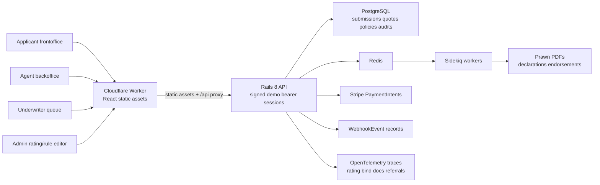

# PhotoBind

PhotoBind is a quote-to-bind platform prototype for small commercial general liability insurance for photographers.

It models the lifecycle that real insurance systems care about:

- Submission intake
- Eligibility and underwriting referral
- Configurable rating and quote comparison
- Bind request and policy issuance
- Immutable policy snapshots
- Endorsement hooks
- Audit events, webhooks, and admin rate/rule versions
- Rails 8.1 API backend on Ruby 4.0 with PostgreSQL persistence
- Sidekiq workers backed by Redis for asynchronous PDFs, endorsements, and webhook-style work
- Real API controllers for quote, bind, documents, audit, webhooks, referrals, admin rating tables, and partner endpoints
- React frontoffice/backoffice flows use signed Rails API sessions instead of browser localStorage as the source of truth
- Stripe-shaped payment intents with idempotent bind and payment authorization requests

## Run it

```bash
npm install
npm run dev
```

Start Redis before the Rails worker process:

```bash
docker compose up -d redis
# or, on macOS without Docker:
brew install redis
/opt/homebrew/opt/redis/bin/redis-server /opt/homebrew/etc/redis.conf
```

## Rails API

The production-style backend lives in `backend/` and was generated with Rails 8.1.3 on a workspace-local Ruby 4.0.3 install.

```bash
cd backend
GEM_HOME=../.gems/ruby-4.0.3 GEM_PATH=../.gems/ruby-4.0.3 PATH=../.gems/ruby-4.0.3/bin:../.rubies/ruby-4.0.3/bin:/opt/homebrew/opt/postgresql@16/bin:$PATH ./bin/dev
```

Key endpoints include:

- `POST /api/submissions`
- `POST /api/session`
- `POST /api/submissions/:id/quote`
- `POST /api/payment-intents`
- `POST /api/quotes/:id/request_bind`
- `POST /api/underwriting/referrals/:id/approve`
- `POST /api/policies/:policy_id/endorsements`
- `POST /api/policies/:policy_id/endorsements/:id/issue`
- `POST /api/policies/:policy_id/renewals`
- `POST /api/renewals/:id/request_bind`
- `GET /api/renewals`
- `GET /api/policies/:policy_id/documents`
- `GET /api/policies/:policy_id/documents/:document_id`
- `GET /api/admin/rating-tables`
- `POST /api/partner/v1/quotes`
- `POST /api/partner/v1/bind`

## Verify

```bash
npm test
npm run build

cd backend
GEM_HOME=../.gems/ruby-4.0.3 GEM_PATH=../.gems/ruby-4.0.3 PATH=../.gems/ruby-4.0.3/bin:../.rubies/ruby-4.0.3/bin:/opt/homebrew/opt/postgresql@16/bin:$PATH bundle exec rails test
```

`backend/bin/dev` starts both Puma and Sidekiq. Sidekiq expects Redis at `REDIS_URL`, defaulting to `redis://127.0.0.1:6379/0`. You can also run the asynchronous worker by itself with:

```bash
cd backend
GEM_HOME=../.gems/ruby-4.0.3 GEM_PATH=../.gems/ruby-4.0.3 PATH=../.gems/ruby-4.0.3/bin:../.rubies/ruby-4.0.3/bin:/opt/homebrew/opt/postgresql@16/bin:$PATH ./bin/jobs
```

## Cloudflare Workers

The React frontend deploys as a Cloudflare Workers static-assets app. The Worker serves `dist/`, uses SPA fallback routing so deep links return `index.html`, and proxies `/api/*` to the Rails origin configured by `API_ORIGIN`.

Create Cloudflare Worker variables:

```bash
npx wrangler secret put API_ORIGIN
```

Set `API_ORIGIN` to the public Rails origin, for example `https://api.photobind.example.com`. The Vite build can also call the API directly when `VITE_API_BASE_URL` is set:

```bash
VITE_API_BASE_URL=https://your-rails-api.example.com npm run workers:deploy
```

For local Worker preview:

```bash
VITE_API_BASE_URL=http://127.0.0.1:3000 npm run workers:preview
```

## Rails Deployment

The Rails API is a normal containerized Rails service, not a Worker. Deploy it behind Cloudflare DNS or a Cloudflare Tunnel, then point the frontend Worker `API_ORIGIN` at that Rails URL.

Required production services:

- PostgreSQL for Rails domain data.
- Redis for Sidekiq.
- A Rails web process: `bundle exec rails server`.
- A Sidekiq worker process: `./bin/jobs`.
- Optional OTLP collector endpoint for traces.

Use [backend/.env.production.example](/Users/winston/dev/photo-bind/backend/.env.production.example) as the env checklist. Important variables:

- `DATABASE_URL`
- `REDIS_URL`
- `SECRET_KEY_BASE`
- `RAILS_MASTER_KEY`
- `PHOTOBIND_CORS_ORIGINS=https://photobind.example.com`
- `STRIPE_SECRET_KEY` and `STRIPE_PUBLISHABLE_KEY`
- `OTEL_EXPORTER_OTLP_ENDPOINT` and `OTEL_EXPORTER_OTLP_HEADERS`

Cloudflare Tunnel example config lives at [ops/cloudflared/config.example.yml](/Users/winston/dev/photo-bind/ops/cloudflared/config.example.yml). A typical split is:

- `photobind.example.com` -> Cloudflare Worker static frontend.
- `api.photobind.example.com` -> Rails API through Tunnel or a public load balancer.
- Rails CORS allows only the Worker/frontoffice origins through `PHOTOBIND_CORS_ORIGINS`.

## Observability

OpenTelemetry is production-configurable through env vars. Rails, Rack, Active Record, rating, bind, document generation, referrals, and payment events emit traces or structured audit logs.

Local or hosted collector starter files:

- [ops/otel-collector.yaml](/Users/winston/dev/photo-bind/ops/otel-collector.yaml)
- [ops/grafana-dashboard-photobind.json](/Users/winston/dev/photo-bind/ops/grafana-dashboard-photobind.json)

Set `OTEL_EXPORTER_OTLP_ENDPOINT` to an OTLP HTTP traces endpoint such as `https://otel-collector.example.com/v1/traces`. Use `OTEL_EXPORTER_OTLP_HEADERS` for vendor auth headers.

## Architecture



## Portfolio talking points

- Rating is performed by Rails `RatingEngine` using persisted `RatingFactor` rows and explainable premium breakdowns.
- Rails services handle workflow transitions, explainable rating, idempotent bind, policy snapshots, PDF generation, audit events, and webhook records.
- Signed Rails API session tokens model agent, underwriter, admin, and applicant roles for the demo.
- Underwriting rules are versioned and produce persisted `UnderwritingDecision` records for system rule evaluations and human referral decisions.
- Rating tables are persisted and drive rating calculations through `RatingFactor`.
- OpenTelemetry instruments Rails, Rack, Active Record, custom rating/bind spans, and is configurable through OTLP env vars with collector/dashboard starter configs.
- The state machine blocks invalid lifecycle transitions.
- Financial calculations use integer cents, explicit tax/stamping basis points, policy fees, Stripe-shaped payment intents, idempotent payment authorization, and prorated endorsement deltas.
- Endorsements support separate revenue, limit, and address changes, quote-before-issue review, proration, and generated endorsement documents.
- Renewal APIs and UI expose expiring policies, renewal quote creation, renewal quote review, renewal bind, and renewal issuance narrative.
- Policy issuance snapshots the exact submission, quote option, rating version, and rule version used at bind time.
- PostgreSQL stores submissions, businesses, risks, quotes, quote options, referrals, underwriting decisions, policies, policy terms, documents, audit events, payments, webhook events, rating factors, rules, and idempotency keys.
- The UI includes agent, underwriter, admin, policy, analytics, audit, webhook, endorsement, and renewal surfaces wired to Rails APIs.
